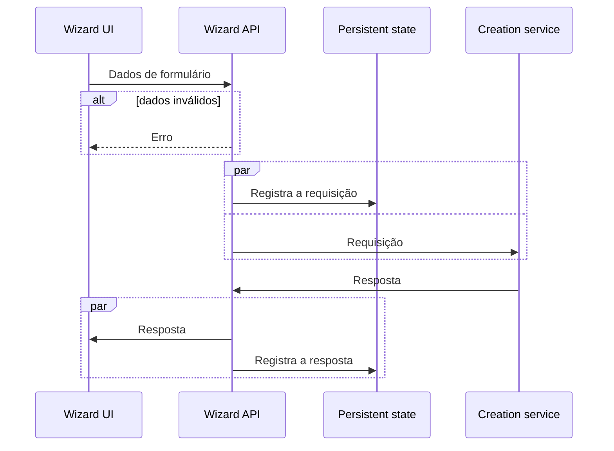
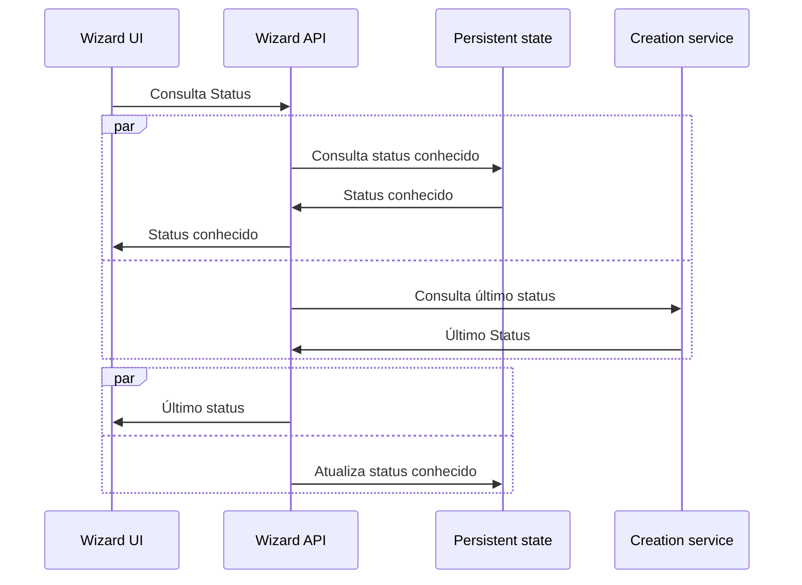

# Wizard API

API genérica para a configuração inicial (contratação) de qualquer coisa.

Também conhecido como "o backend(BFF) de referência do projeto [Wizard UI](https://github.com/jaxyendy/wizard-ui)".

# Tecnologias
- [Rust](https://www.rust-lang.org/) 1.64.0
- [Rocket.rs](https://rocket.rs/) 0.5.0-rc2 

# Servidor de desenvolvimento

```
# launch dev server on localhost:8000
cargo run
```

# Contribuições

Este repositório pode estar espelhado em outros lugares, para contribuir com melhorias ou relatar
problemas, utilize a página deste projeto no Github: https://github.com/jaxyendy/wizard-api

Se você está lendo este README fora do Github, não deixe de ler também o
arquivo [DISTRO.md](DISTRO.md).

# Licença

A definir.
<small>(gostamos muito da AGPL3, mas MIT pode ser mais flexível)</small>


## Fluxos

Esta API é "stateless" e por sua vez conversa com um outro serviço (Persistent state) para
armazenar o log das requisições e respostas ao serviço (Creation service) que de fato cria a "coisa" 
contratada.

#### Contratação



#### Consulta



